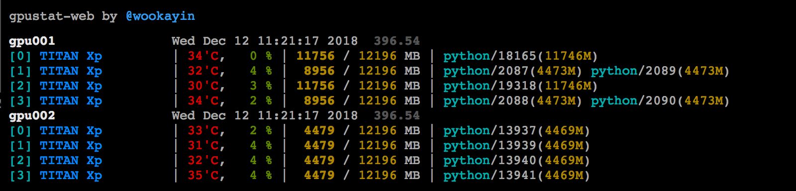

gpustat-web
===========

A web interface of [`gpustat`][gpustat] ---
aggregate `gpustat` across multiple nodes.

<p align="center">
  
</p>

**NOTE**: This project is in alpha stage. Errors and exceptions are not well handled, and it might use much network resources. Please use at your own risk!


Usage
-----

Launch the application as follows. SSH connections will be established to each of the specified hosts.
Make sure ssh works under a proper authentication scheme such as SSH key (e.g. `id-rsa`).
It is known that asyncssh [does NOT obey](https://github.com/ronf/asyncssh/issues/108) `~/.ssh/config` file
(e.g. alias, username, keyfile), so just be aware of this.

```
python -m gpustat_web --port 48109 HOST1 [... HOSTN]
```

Python 3.6+ is required.

Python 3.7+ is recommended because you may encounter issues about Openssl and cryptography with python 3.6.

[gpustat]: https://github.com/wookayin/gpustat/


### More Examples

To see CPU usage as well:

```
python -m gpustat_web --exec 'gpustat --color --gpuname-width 25 && echo -en "CPU : \033[0;31m" && cpu-usage | ascii-bar 27'
```


License
-------

MIT License

Copyright (c) 2018-2019 Jongwook Choi
